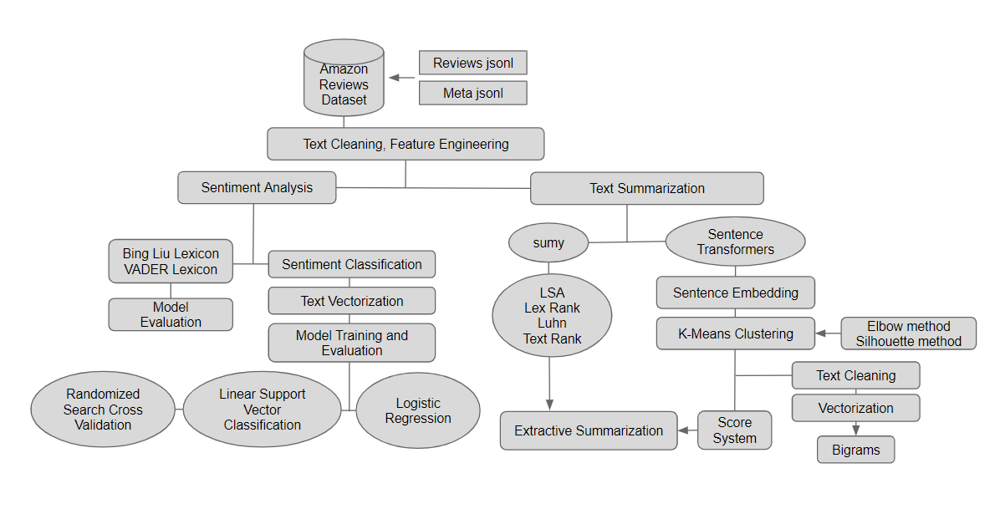

# NLP - Sentiment Analysis and Text Summarization of Amazon Product Reviews

## Project Organization

## Objective
The **NLP - Sentiment Analysis and Text Summarization of Amazon Product Reviews** project is designed to analyze customer sentiment and generate summaries of customer reviews on Amazon products. This project primarily uses Natural Language Processing (NLP) techniques to provide insights into customer opinions and highlight product features that need improvement or is successful from text reviews. This project serves as my capstone project for Nashville Software School's Data Science Bootcamp. 

The following image is an overall outline of the project: 

## Datasets 
The Amazon Reviews Dataset is collected from the University of California's San Diego McAuley Lab (https://amazon-reviews-2023.github.io/main.html). The complete 2023 dataset is split into 34 categories. This project will be working on a subset of the Sports and Outdoors category, which has 10.3 million users, 1.6 million items, and 19.6 million ratings. It consists of two JSON Lines files: one for user reviews and one for item metadata. 

### User Reviews 
- rating: product rating (1 - 5)
- title: user review title 
- text: text body of user review 
- images: images that users post after their product is delivered. Image size is depicted in the title (ie small_image_url).
- asin: product ID. 
- parent_asin: parent ID of the product. Products with different colors, styles, and sizes belong to the same parent ID. Use this to find product meta. 
- user_id: reviewer ID 
- timestamp: time of the review 
- verified_purchase: user purchase verification 
- helpful_vote: count of helpful votes of the review 

### Item Metadata
- main_category: main category (domain) of the product
- title: name of the product
- average_rating: rating of the product shown on the product page
- rating_number: number of ratings in the product
- features: bullet-point format features of the product
- description: product description
- price: price in USD
- images: product images
- videos: videos of the product including title and url
- store: store name of the product
- categories: hierarchical categories of the product
- details: product details, including materials, brand, sizes, etc.
- parent_asin: parent ID of the product
- bought_together: recommended bundles from websites

Data fields retrieved from https://amazon-reviews-2023.github.io/main.html.

## Features 
- **Sentiment Analysis**: Classifies reviews as positive or negative.
- **Text Summarization**: Generates brief summaries from lengthy reviews with highlights on customer likes and dislikes for product improvement.
- **Visualization**: Presents data insights and results through charts and graphs.
- **Web Application**: User-friendly interface for users to browse through different brands and products and display NLP results.

## Sentiment Analysis 
This project used unsupservised learning and supervised learning methods to analyze customer sentiment. With unsupervised learning, it used Bing Liu and VADER lexicons to analyze sentiment. After creating a test and train dataset, the following models were used to analyze the sentiment: Randomized Search Cross Validation, Logistic Regression, and Linear Support Vector Classification. 
## Text Summarization 
Sumy and Sentence Transformers (SBERT) libraries were used to create extractive text summarization. Wordcluds were used to display the top 50 used bigrams. 

